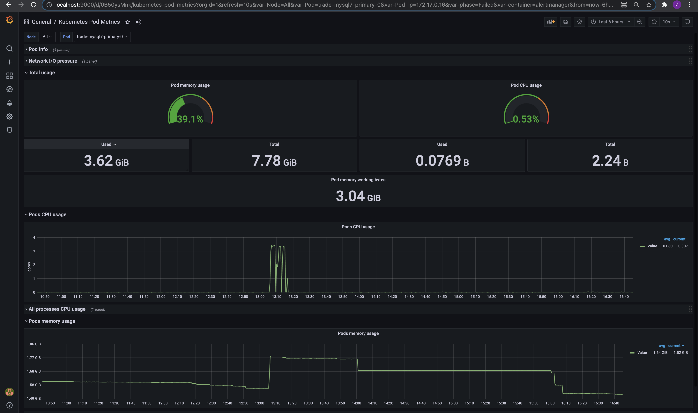

# Отчет по репликации

## Приложение и конфигурация для нагрузочного тестирования

Описание установки приложения, репозиториев, исходных кодов, образов и дашбордов
(https://github.com/orensimple/trade-cube/blob/main/README.md)

Для нагрузочного тестирования использовался WRK
С помощью метода api/users/mock было создано 1 000 000 фейковых пользователей
Нагрузка осуществлялась по поиску пользователей api/users/search

`wrk -t2 -c100 -d600s -s random_search.lua http://arch.homework`

trade.postman_collection.json
(https://github.com/orensimple/trade-cube/blob/main/trade.postman_collection.json)

Согласно ТЗ использовалась асинхронная репликация для нагрузочного тестирования
В приложении переключение между репликами было реализовано с помощью gorm.io/plugin/dbresolver

## Результаты нагрузочного тестирования

Нагрузка на чтение на мастер:
`0000NBA05FYMD6M:trade-cube iyivano8$ wrk -t2 -c100 -d600s -s random_search.lua http://arch.homework
Running 10m test @ http://arch.homework
  2 threads and 100 connections
  Thread Stats   Avg      Stdev     Max   +/- Stdev
    Latency   686.60ms  566.49ms   2.00s    60.93%
    Req/Sec    13.04      9.59   100.00     79.45%
  12554 requests in 10.00m, 296.03MB read
  Socket errors: connect 0, read 0, write 0, timeout 5178
Requests/sec:     20.92
Transfer/sec:    505.14KB
`

Нагрузка на чтение на слейвы, балансировку между слейвами осуществлял сам кубернетес
`0000NBA05FYMD6M:trade-cube iyivano8$ wrk -t2 -c100 -d600s -s random_search.lua http://arch.homework
Running 10m test @ http://arch.homework
  2 threads and 100 connections
  Thread Stats   Avg      Stdev     Max   +/- Stdev
    Latency   665.51ms  567.76ms   2.00s    62.18%
    Req/Sec    11.92      8.69    67.00     80.10%
  11236 requests in 10.00m, 265.66MB read
  Socket errors: connect 0, read 0, write 0, timeout 4843
Requests/sec:     18.72
Transfer/sec:    453.33KB
`
Master:

Slave-0:

Slave-1:

## Конфигурация полусинхронной репликации
В конфиг Mysql добавлены парметры
`    gtid_mode=ON
    enforce-gtid-consistency=ON`
(https://github.com/orensimple/trade-cube/blob/main/mysql.yaml)

Мною была выбрана Semisynchronous Replication
Настройку и включение выполнена согласна инструкции из официальной документации
(https://dev.mysql.com/doc/refman/8.0/en/replication-semisync-installation.html)

Нагрузка осуществлялась приложением с помощью метода api/users/mock
Доработка коснулась вставки по одному значению и логгированию успешно выполненых запросов

## Результаты тестирования полусинхронной репликации

Успешно записано строк | Строк на slave0 | Строк на slave1
--- | --- | --- 
2056 | 2056 | 2056
23456 | 23456 | 23455
76523 | 76522 | 76523

После апдейта самого свежего слейва до мастера, второй слейв догнал репликацию
Потери транзакции отсутствовали